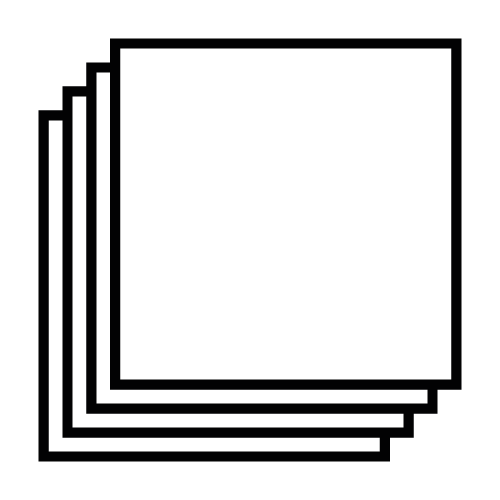

<p align="center">
  <a href="https://superprint.cc">
    
  </a>
</p>

<h1 align="center">SuperPrint</h1>

<p align="center">
  <b>Professional desktop publishing, in your browser.</b><br>
  L'atelier de PAO qui tient dans un navigateur. · ブラウザの中のプロのレイアウト工房。
</p>

<p align="center">
  <a href="https://superprint.cc"><b>🌐 superprint.cc</b></a> ·
  <a href="https://superprint.cc/landing.html">Landing</a> ·
  <a href="https://superprint.cc/sp213-studio.html">SP213 AI Studio</a> ·
  <a href="https://superprint.cc/documentation.html">Documentation</a> ·
  <a href="mailto:contact@superprint.cc">contact@superprint.cc</a>
</p>

<p align="center">
  
  
  
  
  
</p>

---

## ✦ SuperPrint in one sentence

**SuperPrint** is a **professional page-layout and prepress (DTP) application that runs entirely in the browser** — free, no subscription, no account, no ads. It combines a **real multi-page layout editor** (bleed, CMYK, fine typography, master pages…) with an **AI layout studio, SP213**, which turns a plain written brief into a print-ready, fully editable document.

> Online or local, your documents stay **on your machine**. Nothing is sent to a third party unless you choose your own AI provider.

---

## ✦ Why SuperPrint?

- **A real DTP tool, not a toy** — real millimeter formats, trim marks, bleed, master pages, layers, linked text frames, editorial typography with automatic hyphenation (FR · EN · DE · ES · IT · JA).
- **Offset-ready export** — **CMYK** PDF with ICC profiles (Coated FOGRA39, SWOP, Japan Color), Pantone spot-color support, on-screen soft-proof simulation, and offset **imposition**.
- **100 % browser-based** — nothing to install for online use — Chrome, Firefox, Safari, Edge.
- **No subscription, no account, no tracking** — open it and start composing.
- **Offline PWA** — installable as a desktop app; auto-save every 12 s to local IndexedDB.
- **AI layout (SP213)** — from brief to draft through conversation — DeepSeek, Groq, OpenRouter, or fully local WebLLM models over WebGPU.
- **Interoperability** — import your documents (Word, OpenDocument, PDF, SVG/PNG/JPG/WebP images, IDML) and export to many formats.

---

## ✦ What can you compose?

| | | |
|---|---|---|
| 🎉 Flyers & posters | 📚 Brochures & catalogs | 📰 Magazines & newsletters |
| 🎓 Course material | 📊 Reports & business docs | 🎵 Sleeves, programs, booklets |

---

## ✦ How to use it

### Online (nothing to install)
→ **[https://superprint.cc](https://superprint.cc)** — the app opens in seconds.

### Locally (single line)
Requirements: [Node.js 18+](https://nodejs.org)

**Windows (PowerShell)**
```powershell
npx.cmd superprint@latest
```

**macOS / Linux**
```bash
npx superprint
```

On first launch the launcher downloads the app (~50 MB), installs its dependencies and opens **http://127.0.0.1:5173** — the server stays on your local loopback (not exposed to the network).

### From this repository
This repository contains the full product. The web app can be served as static files from the `superprint/` folder, while `sp213-local/` is the local Vite + WebLLM distribution used by the `npx superprint` launcher.

---

## ✦ Feature highlights

- Multi-page documents, facing-page spreads and offset **imposition**
- **CMYK / RGB / grayscale** PDF export up to **600 DPI** with bleed, trim marks and color bars
- **Vector typography** export — real selectable text with embedded fonts (no rasterization)
- Import: Word (.docx), OpenDocument (.odt), RTF, PDF page-by-page, IDML, images, SVG
- Export: PDF, PNG, JPG, IDML, native `.sp`
- Master pages, layers, guides & grids, linked text frames, multilingual hyphenation engine
- Pathfinder boolean operations, image masking, Bézier pen tool, image filters
- GPU acceleration (WebGL), light & dark themes, keyboard-first workflow
- **SP213 Studio** — AI-generated layouts, online (DeepSeek/Groq/OpenRouter) or fully local (WebLLM via WebGPU)

---

## ✦ The repository

| Folder | Role |
|---|---|
| `superprint/` | The complete web application + landing + SP213 studio + documentation |
| `sp213-local/` | The local distribution (Vite + WebLLM), served by the npm launcher |
| `superprint-npm/` | The `superprint` npm launcher (`npx superprint`) |

---

## ✦ Privacy

SuperPrint is designed to be **privacy-friendly**:

- Documents and auto-saves live in **your browser** (IndexedDB) or on **your machine**.
- No account, no telemetry, no advertising.
- The optional AI studio only sends data to a provider **if you explicitly enable one** (cloud models) — or you can run it **fully locally** with WebLLM.

---

## ✦ Contacts

- **Website** : [superprint.cc](https://superprint.cc)
- **Email** : [contact@superprint.cc](mailto:contact@superprint.cc)
- **X / Twitter** : [@SUPER_PRINT_app](https://x.com/SUPER_PRINT_app)
- **AI Studio** : [superprint.cc/sp213-studio.html](https://superprint.cc/sp213-studio.html)

**Built by** Simon Dupont-Gellert & Clémence Brunet — an independent project, ad-free, no data collection.

---

*SuperPrint is provided free of charge, "as is". Trademarks belong to their respective owners.*