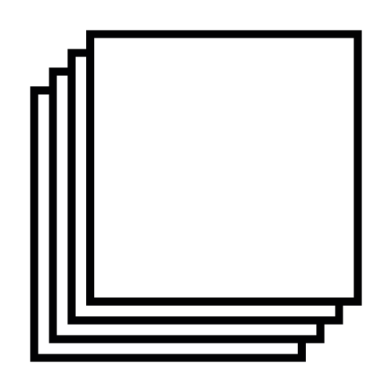

<p align="center">
  <a href="https://superprint.cc">
    
  </a>
</p>

<h1 align="center">SuperPrint</h1>

<p align="center">
  <b>Professional desktop publishing, in your browser.</b><br>
  L'atelier de PAO qui tient dans un navigateur. · ブラウザの中のプロのレイアウト工房。
</p>

<p align="center">
  <a href="https://superprint.cc"><b>🌐 superprint.cc</b></a> ·
  <a href="https://superprint.cc/sp213-studio.html">Studio IA</a> ·
  <a href="https://superprint.cc/supertypo/">SuperTyPo</a> ·
  <a href="https://superprint.cc/documentation.html">Documentation</a> ·
  <a href="https://superprint.cc/api.html">Script API</a> ·
  <a href="mailto:contact@superprint.cc">contact@superprint.cc</a>
</p>

<p align="center">
  <a href="CHANGELOG.md"><b>📋 Changelog</b></a> ·
  <a href="https://github.com/zigmoon/SUPERPRINT/tags">Releases</a> ·
  <a href="https://app.zigmoon.com/release.html">Release notes (FR/EN/JP)</a>
</p>

<p align="center">
  
  
  
  
  
  
  
</p>

---

## ✦ SuperPrint in one sentence

**SuperPrint** is a **professional page-layout and prepress (DTP) application that runs entirely in the browser** — free, no subscription, no account, no ads. It combines a **real multi-page layout editor** (bleed, CMYK, **spot inks**, master pages, linked text frames, fine typography) with an **AI layout studio** that turns a written brief into a print-ready, fully editable document.

> Online or local, your documents stay **on your machine**. Nothing is sent anywhere unless you deliberately enable a cloud AI provider.

---

## ✦ The SuperPrint family

SuperPrint is not a single tool: it is a small **family of browser-based creative applications** sharing the same design language, formats and workflow.

| App | Entry point | What it does |
|---|---|---|
| **SuperPrint** | `app/index.html` | The full **DTP / prepress layout editor** — pages, spreads, bleed, CMYK, master pages, typography, imposition. |
| **Studio IA** | `sp213-studio.html` | The **AI layout studio** — describe a brief in plain language and get a print-ready, editable document. Accepts office documents (see below) and reads their **full structure**. |
| **SuperTyPo** | `supertypo/index.html` | A **font decomposer & typeface editor** — drop a font, edit each glyph as vector contours, re-export the typeface. |

**Studio IA** accepts a written brief, one or more attached documents, or both. It drives a multi-page layout page by page (up to **120 pages**), places the images you attach, and honours typographic constraints: column width, hyphenation, widows and orphans, bleed. It runs on **cloud models** (DeepSeek, Groq, OpenRouter, Anthropic) **or fully locally** through **WebLLM over WebGPU** — no key, no network, nothing leaving the machine.

**SuperTyPo** turns any `.ttf` / `.otf` / `.woff` / `.woff2` into an editable vector project: each character is **decomposed into contours** that you reshape with the pen tool, then **re-exported** as a modified typeface. Boolean operations (union / subtract / intersect), mirror & 90° rotation, glyph metrics (naming, LSB/RSB, bounding box, point counts) and a versioned native `.sf` (SuperFont) project format. The **« SuperTyPo »** entry of the *New project* dialog opens it directly.

---

## ✦ Under the hood — Astro & Rust

Beyond the application itself, SuperPrint is developed around two modern, open-source foundations:

- 🚀 **The website is built with [Astro](https://astro.build)** — the marketing site and the docs are no longer a pile of hand-written HTML pages but an Astro project (`superprint_ASTRO/`) with shared components, a single `<head>` factory and scripts extracted to files. **The published URLs do not change** (`/`, `/faq.html`, `/supertypo/index.html`…) — it is *how the site is served*, not a new app.
- 🦀 **The computing core is written in [Rust](https://www.rust-lang.org)** (`superprint_rust/`) — pure, dependency-free and testable primitives (typographic units, RGB/CMYK colour, print geometry, and the **spot-ink / PDF separation** engine) compiled to **native and WebAssembly**, so the browser editor can call fast, deterministic, memory-safe code for the heaviest prepress work.

> These two folders are **not** additional applications: **Astro** is *how the site is built*, **Rust** is *how the heavy maths and PDF writing are done*. The apps you open stay **SuperPrint**, **Studio IA** and **SuperTyPo**.

---

## ✦ Formats

### Import

| Category | Formats | Notes |
|---|---|---|
| **Word** | `.docx` · `.doc` | `.docx` via Mammoth **with image extraction**. `.doc` (Word 97-2003) via a real **Compound File Binary** parser — heading levels, lists and tables preserved. |
| **OpenDocument** | `.odt` · `.ods` · `.odp` · `.odg` | Full structure: heading levels, lists, tables, embedded images. |
| **RTF** | `.rtf` | **Page setup is decoded**: paper format, margins, gutter, columns, headers/footers, page breaks. |
| **PDF** | `.pdf` | Page-by-page import. |
| **InDesign** | `.idml` · `.zip` | Stories, `ItemTransform` geometry, linked & embedded images, real font names, recursive groups, rotation, opacity, dashed strokes, real polygons. |
| **Excel** | `.xlsx` · `.xls` | ⚠️ SheetJS is loaded **lazily from a CDN** — Excel import therefore needs a network connection. |
| **Images** | `.png` `.jpg` `.webp` `.gif` `.svg` `.bmp` `.tif` `.eps` `.ai` `.psd` | Drag & drop supported everywhere. |
| **Other** | `.sla` (Scribus, **BETA**) · `.csv` · `.html` · `.txt` · `.md` | |
| **Projects** | `.sp` (native) · `.json` | Native project format; `resources` carry fonts, colours and **Pantone spot inks**. |
| **Fonts & colour** | `.ttf` `.otf` `.woff2` · `.icc` `.icm` · `.ase` | Custom fonts, custom ICC profiles for standard and imposed export, and **your own swatch books**: an Adobe Swatch Exchange (`.ase`) file is parsed in the browser and joins the palette as a new colour library. |

### Export

| Output | Options |
|---|---|
| **PDF** | Four qualities — **Standard 72 DPI · Medium 200 DPI · HD 300 DPI · ULTRA HD 600 DPI**. Bleed, trim marks, colour bar, **imposition** for offset, spread (facing pages), and **vector typography** (real selectable text with embedded fonts — not rasterised). |
| **PDF/X** | `PDF/X-3:2003` with `OutputIntent` + `DestOutputProfile` and the `GTS_PDFX` watermark. |
| **CMYK** | Conversion through **ICC profiles** — three ship with the app: **Coated FOGRA39**, **US Web Coated SWOP**, **Japan Color 2001 Coated**. Custom profiles can be loaded. Adjustable GCR and ink limit, plus an on-screen soft-proof simulation. |
| **Spot colours** | Spot inks written as real `/Separation` colour spaces, from **six built-in swatch books** — **Toyo Color Finder** (46 shades), **Focoltone** (48), **HKS** (54), **RAL** (191), **NCS** (55), **DIC** (49) — plus **your own `.ase` libraries**; the 246-ink **Pantone** palette stays in the catalogue. The quadri layer under them is selectable: **CMYK + spot inks** or **RGB + spot inks** — the tint function follows the chosen space, so RGB spots stay bright instead of being squeezed through the CMYK gamut. |
| **Image** | **PNG** (white or transparent background) · **JPG**. |
| **Project** | `.sp` (native) · `.json`. |

> ℹ️ **IDML is import-only.** There is no IDML export — the native exchange format is `.sp`.

---

## ✦ Why SuperPrint?

- **A real DTP tool, not a toy** — real millimetre formats, bleed, trim marks, master pages, layers, guides & grids, linked text frames, editorial typography with **automatic hyphenation**.
- **Offset-ready output** — CMYK + ICC, spot inks from six built-in swatch books (**Toyo Color Finder, Focoltone, HKS, RAL, NCS, DIC**) plus your own **`.ase`** libraries, PDF/X-3, imposition, and a soft-proof preview.
- **Typography that survives export** — vector PDF keeps text selectable and searchable. Hyphenation dictionaries ship for **French, English, German, Spanish and Italian**.
- **100 % browser-based** — nothing to install for online use: Chrome, Firefox, Safari, Edge.
- **No subscription, no account, no tracking** — open it and start composing.
- **Offline PWA** — installable as a desktop app, with an auto-save net in **IndexedDB**.
- **AI that can stay local** — run Studio IA on cloud models, or entirely offline with WebLLM over WebGPU.
- **Interoperability** — import the documents you already have; export print-ready files.

---

## ✦ Spot colours & swatch books

The Colour panel is a **list of colour libraries**, each one an accordion you open to pick a shade:

| Swatch book | Shades | Notes |
|---|---|---|
| **Toyo Color Finder** | 46 | Japanese ink system, grouped by family (yellows, reds, greens, blues…) |
| **Focoltone** | 48 | Process-oriented reference set |
| **HKS** | 54 | HKS K (coated) reference, codes 1 K → 80 K |
| **RAL** | 191 | RAL Classic, with **French colour names** (RAL 3020 Rouge signalisation, RAL 7016 Gris anthracite…) |
| **NCS** | 55 | Natural Colour System notation (S 0500-N, S 2060-B, S 4050-G…) |
| **DIC** | 49 | Japanese DIC reference |
| **Pantone** | 246 | Kept in the catalogue — its own accordion arrives in a coming release |
| **Your own** | any | Import an Adobe Swatch Exchange **`.ase`** file → it joins the list under the file name |

- Every shade is a row with its **colour dot and its name**; a click applies the ink to the **fill or the stroke** of the selection, with the same CMYK slider sync, undo history and spot-ink badge as before.
- **`.ase` import** (RGB, CMYK, Lab and Grey entries) is parsed **in the browser** — nothing is uploaded — and the imported library comes back on the next visit (it can be removed with a ✕).
- The built-in shade values are **screen-preview sRGB conversions**, not the manufacturers' official libraries — this is stated in the interface. For exact values, import the library the manufacturer provides as `.ase`.
- On export, every ink still becomes its **own named `/Separation` channel**: adding libraries does not change how plates are produced.

---

## ✦ What can you compose?

| | | |
|---|---|---|
| 🎉 Flyers & posters | 📚 Brochures & catalogs | 📰 Magazines & newsletters |
| 🎓 Course material | 📊 Reports & business docs | 🎵 Sleeves, programs, booklets |

---

## ✦ How to use it

### Online — nothing to install
→ **[https://superprint.cc](https://superprint.cc)** — the app opens in seconds.

### Locally, with the npm launcher

Requirement: [Node.js 18+](https://nodejs.org).

**Windows (PowerShell)**

```powershell
npx.cmd superprint@latest
```

The `.cmd` wrapper matters on Windows: `npm.ps1` / `npx.ps1` can be blocked by the PowerShell execution policy. Using `npx.cmd` avoids changing it. If you prefer installing first, use `npm.cmd i superprint` then `npx.cmd superprint`.

**macOS / Linux**

```bash
npx superprint
```

On first launch the launcher downloads the application (**~54 MB**), installs its local dependencies and opens **http://127.0.0.1:5173**. The server binds to the **loopback interface**, so it is never exposed to your network or the Internet. Later launches reuse the installed copy and detect updates automatically.

Vite options can be passed through: `npx superprint --port 5174`. Only use `--host 0.0.0.0` on a trusted network, when you deliberately want another device to reach the app.

### From this repository

The web app is plain HTML/CSS/JS with **no build step** — serve `superprint/` with any static server:

```bash
git clone https://github.com/zigmoon/SUPERPRINT.git
cd SUPERPRINT
python -m http.server 8000 --directory superprint
# open http://localhost:8000/app/index.html
```

`sp213-local/` is the **local Vite + WebLLM distribution** used by the npm launcher; build it with `npm install && npm run build` inside that folder.

---

## ✦ Feature highlights

- Multi-page documents, facing-page **spreads**, and offset **imposition**
- **CMYK / RGB / grayscale** PDF export up to **600 DPI**, with bleed, trim marks and colour bars
- **Vector typography** export — selectable text, embedded fonts, no rasterisation
- **Spot inks** from six swatch books (**Toyo, Focoltone, HKS, RAL, NCS, DIC**) plus **`.ase`** import, on a CMYK **or** RGB quadri layer
- 3 bundled **ICC profiles** (FOGRA39, SWOP, Japan Color) plus custom profile loading
- Master pages, layers, guides, grids, linked text frames, multilingual hyphenation
- Pathfinder boolean operations, image masking, Bézier pen tool, image filters
- GPU acceleration (WebGL), light & dark themes, keyboard-first workflow
- **Studio IA** — AI-generated layouts, cloud or fully local (WebLLM / WebGPU)
- **SuperTyPo** — decompose and edit any font, `.sf` projects, TTF re-export

---

## ✦ The repository

The repository ships **the product only**: the application, the Astro build of its website, the Rust computing core, and the local / npm helpers. All development tooling (349 scripts, 281 logs, backups, test fixtures) lives outside the repository, in a `_dev/` folder that is git-ignored.

| Path | Role | Tracked |
|---|---|---|
| `superprint/` | **The application** — editor, landing, Studio IA, SuperTyPo, documentation, script API (deployed as-is) | ✅ |
| `sp213-local/` | The local distribution (Vite + WebLLM) downloaded by the npm launcher | ✅ |
| `superprint-npm/` | The `superprint` npm launcher (`npx superprint`) | ✅ |
| `superprint_ASTRO/` | **The website, rebuilt with [Astro](https://astro.build)** — same published URLs, shared components, scripts extracted to files; builds to `dist/` | ✅ |
| `superprint_rust/` | **The computing core, in [Rust](https://www.rust-lang.org)** — pure, dependency-free primitives (units, colour, print geometry), compiled to native *and* WebAssembly | ✅ |
| `tools/` | Two dependency-free helpers: `serve.mjs` (local static server) and `make-release-zip.mjs` | ✅ |
| `README.md` · `CHANGELOG.md` · `release.html` · `.gitignore` | Documentation and release notes | ✅ |
| `_dev/` | Development tooling, logs, backups, fixtures | ❌ ignored |

> 🧱 **Not applications.** The apps you *use* are **SuperPrint** (the editor), **Studio IA** and
> **SuperTyPo**. `superprint_ASTRO/` is the **site** — *how it is served* — and `superprint_rust/`
> is the **engine** — *how it computes* (WebAssembly). Neither is a separate application to open:
> the Astro build publishes the very same site, and the Rust core is a library the app can call.

```bash
node tools/serve.mjs        # serve superprint/ on http://127.0.0.1:8080
node tools/make-release-zip.mjs   # rebuild superprint/sp213-local.zip
```

⚠️ **Everything inside `superprint/` is deployed as-is** — it *is* the published website. Development tooling must therefore never be placed there. A safety net in `.gitignore` blocks `superprint/_*`, `superprint/RAPPORT-*.md`, `superprint/.venv/` and `superprint/.vscode/`.

Every release is git-tagged `v1.7.NNN`, so two versions can be diffed directly:

```bash
git log --oneline v1.7.400..v1.7.421      # what changed between two releases
git diff v1.7.380 v1.7.421 --stat         # full diff between two
```

`release.html` holds the **complete trilingual (FR / EN / JP) release notes** — **129 entries** covering the whole family (91 for SuperPrint, spanning `1.7.92` → `1.7.417`) alongside the team's other applications. It is also published at [app.zigmoon.com/release.html](https://app.zigmoon.com/release.html). `CHANGELOG.md` is the condensed English version.

---

## ✦ Privacy

SuperPrint is designed to be **privacy-friendly**:

- Documents, auto-saves and the save history live in your browser, in **IndexedDB** — not on a server.
- **No account, no telemetry, no advertising.**
- **Studio IA** sends data to a provider **only if you explicitly enable one** and supply your own API key. Local reasoning is available instead, through **WebLLM** — no key, no network.

---

## ✦ Requirements

- A current Chromium-based browser is recommended (Chrome, Edge, Brave).
- **WebGPU**-capable hardware and browser are required **only** for the fully local WebLLM models.
- Internet access is needed for the first npm download, for updates, for WebLLM model downloads, for **Excel import** (SheetJS comes from a CDN) and for any **cloud AI** provider.

---

## ✦ Contacts

- **Website** : [superprint.cc](https://superprint.cc)
- **Email** : [contact@superprint.cc](mailto:contact@superprint.cc)
- **X / Twitter** : [@SUPER_PRINT_app](https://x.com/SUPER_PRINT_app)
- **Studio IA** : [superprint.cc/sp213-studio.html](https://superprint.cc/sp213-studio.html)

**Built by** Simon Dupont-Gellert & Clémence Brunet — an independent project, ad-free, no data collection.

---

## ✦ License

**GNU Affero General Public License v3.0 (AGPL-3.0) — free and open source.**
SuperPrint — the page-layout editor, the SP213 AI layout studio, the SuperTyPo font editor,
their source code, documentation and build tooling — is **free software**: you may use,
study, modify and redistribute it under the terms of the AGPL-3.0. See the full text in
[`superprint/LICENSE`](superprint/LICENSE).

Copyright (C) 2026 Simon Dupont-Gellert (Zigmoon) · 2.13.

**In short** — use SuperPrint for any purpose, including commercially, with no fee and no
account; read, study and modify the source; redistribute the original or a modified version
under the same license. If you run a **modified** version as a network service that users
interact with remotely (for example, hosting your own fork at a public URL), **section 13**
of the AGPL requires you to offer those users the complete corresponding source code,
including your changes. Everything **you produce** with SuperPrint belongs to you — your
documents, images, fonts, templates and your exported PDF / PNG / JPG files.

**Trademarks.** The AGPL-3.0 licenses the *code*, not the *name*: "SuperPrint", "SP213" and
"SuperTyPo", and their logos, are trademarks of Simon Dupont-Gellert (Zigmoon), governed
separately — see [`superprint/TRADEMARKS.md`](superprint/TRADEMARKS.md). A public or commercial
fork must not present itself under these names in a way that implies official origin or
endorsement.

**Third-party components** bundled with the application (Fabric.js, pdf-lib, pdf.js, JSZip,
Mammoth, SheetJS, WebLLM, Little CMS `lcms-wasm`), the bundled fonts and the colour-library
names (Pantone, Toyo, Focoltone, HKS, RAL, NCS, DIC) keep their own licenses and trademarks,
which prevail over the AGPL-3.0 for the parts they cover — see
[`superprint/NOTICE.md`](superprint/NOTICE.md). The shade values shipped with the application
are indicative sRGB conversions, not the manufacturers' official libraries — a manufacturer's
own `.ase` file can be imported for exact values.

Commercial licensing, custom builds, white-labelling and partnerships:
**contact@superprint.cc** · **all@2points13.fr**
